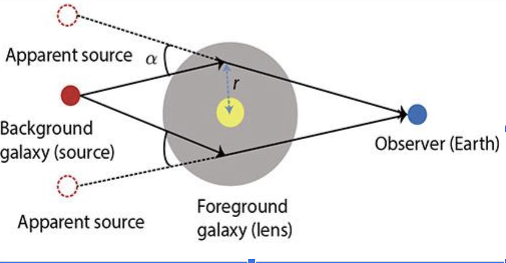
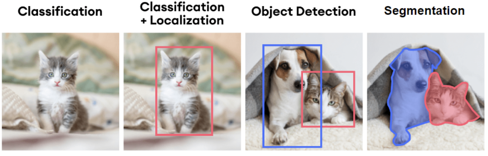

# Image Segmentation for Gravitational Lenses
## Gravitational Lenses

    
    

* Gravitational lenses are an observational phenomenon caused by the alignment of two galaxies separated by cosmological distances.
* The light from the background galaxy bends because of the gravitational forces from the foreground galaxy. 
* This causes the light from the background galaxy to appear to us on earth like a halo or `Einstein Ring`.

## Image Segmentation

* Image segmentation partitions an image into multiple segments on the pixel level.
* Objective is to draw a careful outline around the object that is detected so that you know exactly which pixels belong to the object and which does not.

## Hardware Used
* We used Perlmutter at NERSC i.e National Energy Research Scientific Computing Center ranked as world's `5th most fastest computing platform`.
* It is a high-performance computing user facility operated by Lawrence Berkeley National Laboratory for the United States Department of Energy Office of Science.

## Technology Stack
    | Functionality  | Tools |
    | ------------- | ------------- |
    | Programming Language  | Python3  |
    | Modules | Tensorflow, PyTorch, PIL, Keras, Scikit-learn, NumPy, matplotlib |

## Dataset
* Worked accross 2 datasets namely CHAOS Dataset i.e. `Combined Healthy Abdominal Organ Dataset` and `Galaxy Lenses Simulation Dataset`

    | Dataset | Description|
    | ------------- | ----------- |
    | CHAOS Dataset | Train(~3000 images), Val(~600 images)  |
    | Galaxy Lenses Dataset | Train(~16,000 images), Val/Test(2000 images) |

    <figure><figcaption>CHAOS Dataset</figcaption>
    <figcaption>Galaxy Lenses Dataset</figcaption></figure>

## Data Preprocessing
* Generated masks for the lenses(foreground galaxy) and the arcs(background galaxy) by:
    * Filtering pixel values >99% to extract lenses.
    * Filtering pixel values >95% for arcs.
* Performed pixel value normalization.
* Enhanced arcs brightness by scaling it to a factor of 10.

## Algorithms
### MSRF-Net Model
* MSRF-Net stands for `Multi-Scale Residual Fusion Network`.
* Designed for biomedical image segmentation 
* Able to exchange multi-scale features using a Dual-Scale Dense Fusion (DSDF) blocks. 
* Multi-scale fusion, that allows:
    1. Preservation of resolution
    2. Improved information flow
    3. Propagation of both high and low level features to obtain accurate segmentation maps.

  

### IS-Net Model
* Inspired by the famous U-Net that made breakthrough in Segmentation in 2015.
* A U2-Net architecture, i.e., A U-Net made out of U-Net. 
* Has multiple RSU Blocks of different scales to capture contextual information. 
* Used Intermediate Supervision in the loss function to avoid over-fitting.
 
    

## Performance Evaluation
 

## Results
* Achieved a Mean IOU of 98%

 

* Achieved a Mean IOU of 96%

 
